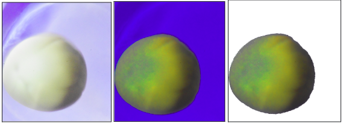

# Modeling Axolotl Embryos

## Introduction

This project uses uncalibrated 3D reconstruction techniques to reconstruct an axolotl embryo using a set of 2D images.

 
*Set of 8 Axolotl Embryo Images*

### Uncalibrated 3D Reconstruction

Recreating an accurate 3D model is still an area of active research where there are different domain specific problems that arise depending on the method used, the type of data available and the complexity of the model that has to be generated.

Since accurate reconstruction techniques rely heavily on additional data in the form of depth maps, camera coordinates, etc.  The approach discussed in this project aims to use uncalibrated images with custom methods to tackle reconstruction that generates spatial information using 2D images that utilise properties of an ellipsoid to recreate the 3D model.

## Project Description
This project aims to tackle these 3 sub problems with varying levels of accuracy to generate the 3D model :-
* Extracting embryo images from given 2D images
* Generating a 3D model based on given 2D images
* Projecting embryo images onto the generated 3D model

### Extracting embryo images
The current method for segmenting embryo images utilises the following steps as shown :

* Modifying the HSV values of the image.
* Masking the background to extract the Region of Interest (Embryo)
* Cropping the Segmented Part.

### Generating the 3D model
Generating the 3D model uses the following steps :-

* Using the outlines/contours generated from the segmented image.
* Using feature detection methods to find the angle of rotation corresponding to each outline.
* Superimposing the outlines together based on the angle of rotation to generate the 3D model

### Projecting embryo images
For projecting the segmented image onto the model the steps used are :-
* Converting all perspective images to modified equirectangular images.
* Using image stitching algorithms to merge them into 1 equirectangular image
* Projecting the equirectangular image onto the generated 3D model
